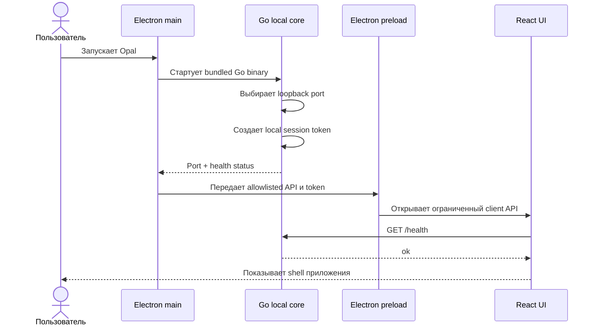
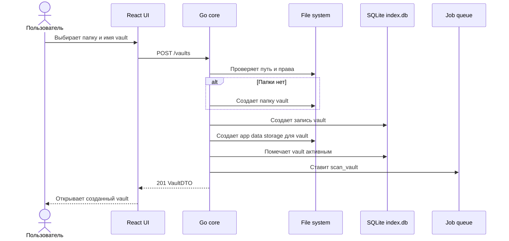
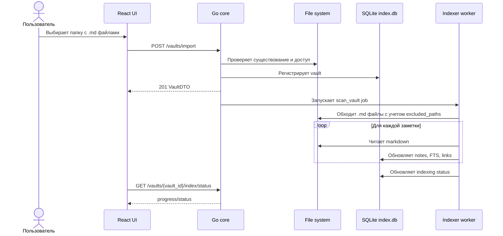
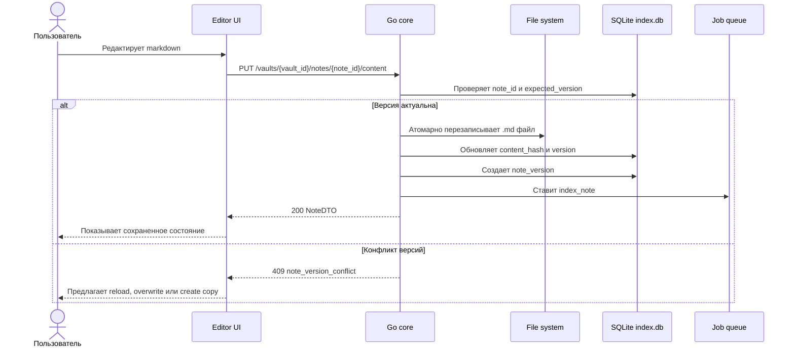
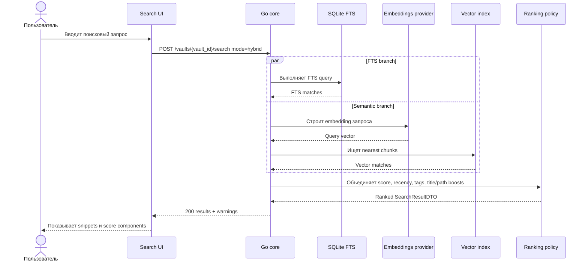
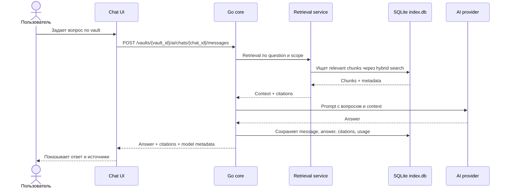
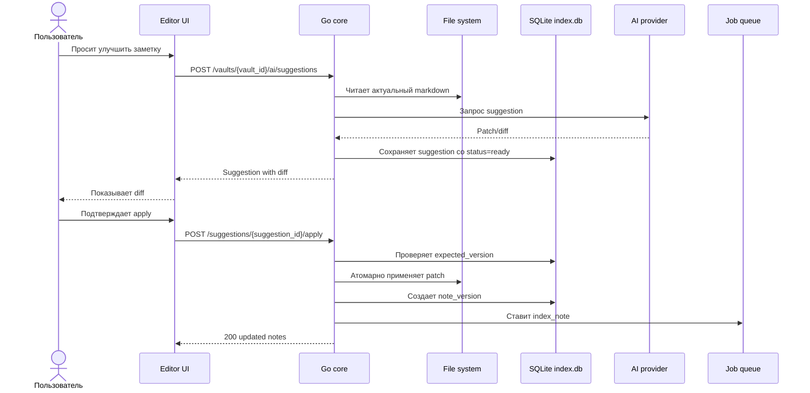
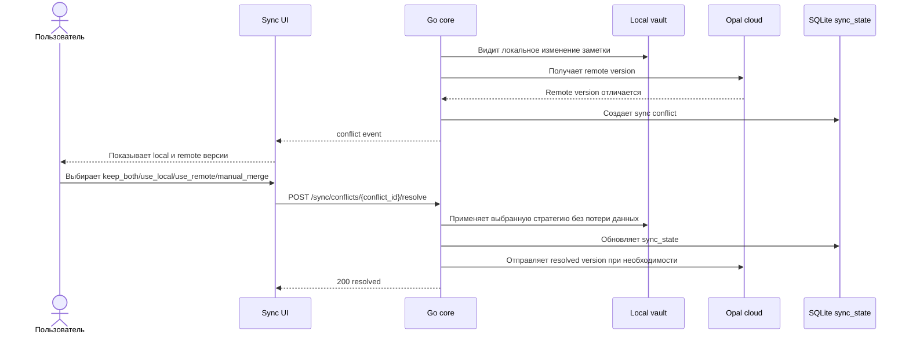

# Сиквенс-диаграммы

Диаграммы описывают основные потоки Opal. Существующие use cases и контракты не меняются.

## 1. Запуск desktop-приложения и local core

## 2. Создание нового vault

## 3. Подключение существующего vault и первичная индексация

## 4. Сохранение заметки с expected_version

## 5. Гибридный поиск

## 6. RAG-чат по заметкам

## 7. AI-suggestion через diff/patch

## 8. Конфликт sync

